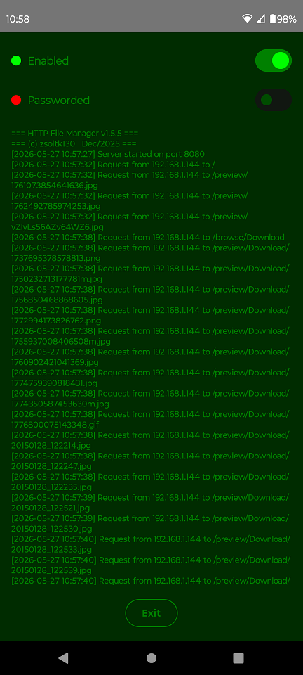
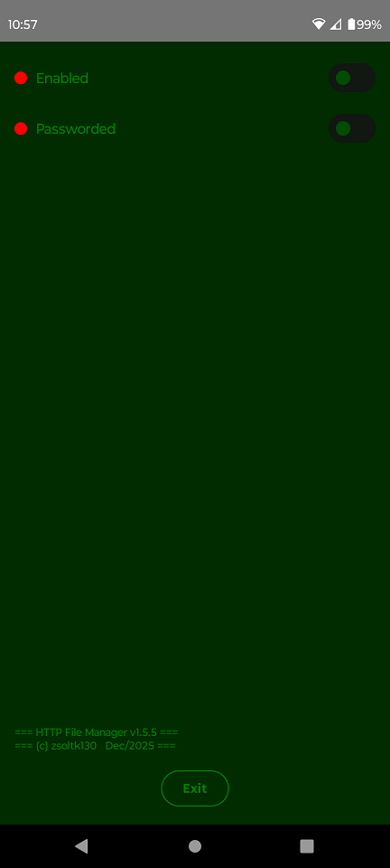
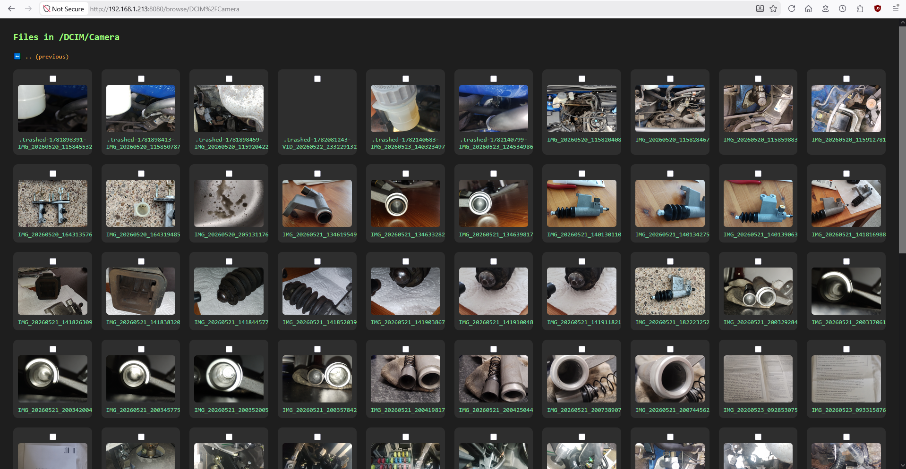
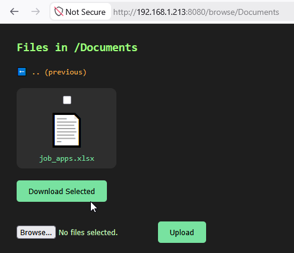

# HTTP-fm

Lightweight HTTP file manager for Android 10+

## About

An asynchronous, lightweight Android local web server built using NanoHTTPD, designed for secure, memory-efficient file synchronization and media streaming between mobile devices and any standard desktop browser without relying on cloud services.

## Screenshots

 
 
 
 

## Details

🎨UI: Jetpack Compose (Kotlin UI framework)

⚙Backend: Kotlin + NanoHTTPD (embedded HTTP server)

💾Storage: Android File APIs (Storage Access Framework)

🌍Networking: Local Wi-Fi IP binding

🔑Permissions: Runtime permissions for storage

🛠Build Tools: Gradle, Android Studio
